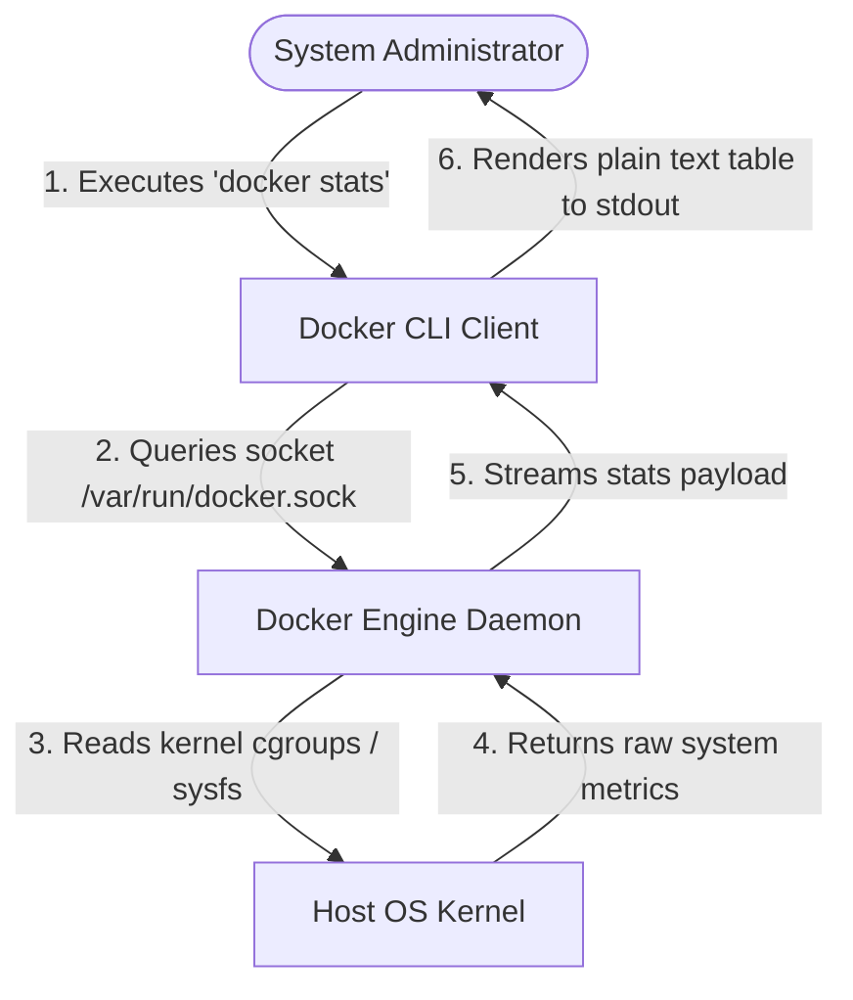
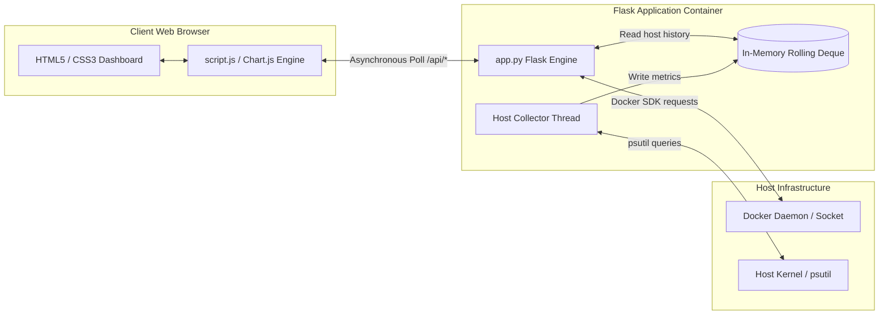
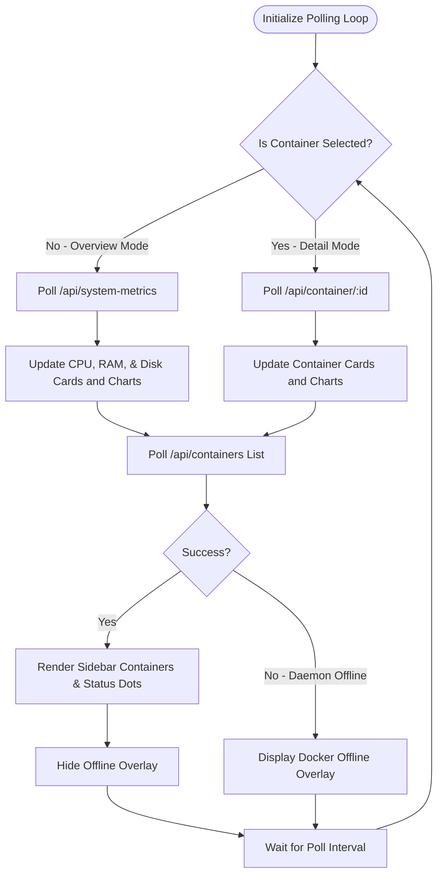
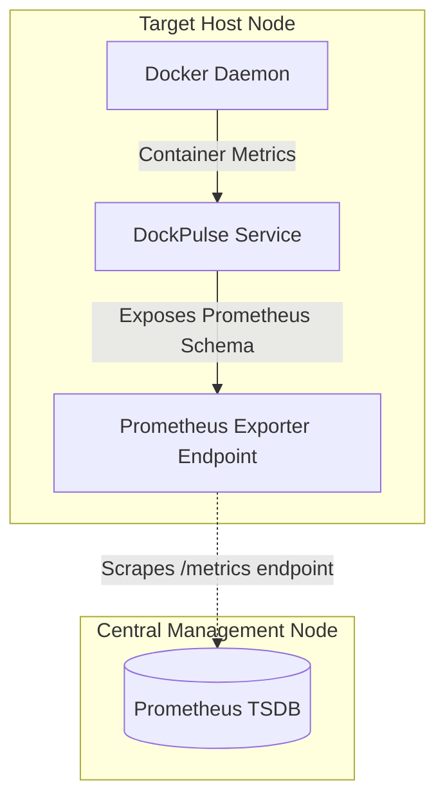

# DockPulse: Real-Time Docker Container Observability & Infrastructure Monitoring Platform

---

## 1. Introduction

### 1.1 Overview
In modern software engineering, the transition from monolithic software systems to microservice-oriented architectures has led to a widespread adoption of containerization technologies. Docker has emerged as the industry standard, enabling developers to package applications and their dependencies into lightweight, isolated containers. However, as the number of running containers increases, maintaining visibility over resource utilization, operational status, and health telemetry becomes a critical challenge. 

**DockPulse** is a lightweight, real-time observability platform designed to monitor Docker containers and host node performance. It interfaces directly with the local Docker engine daemon using the official Python Docker Software Development Kit (SDK) and pulls system metrics using OS-level system libraries (`psutil`). The primary focus is providing developers and DevOps engineers with an intuitive, low-overhead graphical dashboard that displays CPU usage, memory boundaries, network I/O traffic, and container lifecycles in real-time.

### 1.2 Purpose
The main objective of DockPulse is to address the observability gap on development machines and small-scale host nodes. By providing dynamic dashboards with zero external monitoring agents, DockPulse:
1. Facilitates early detection of container health deterioration or CPU/memory leaks.
2. Bridges the gap between raw, tabular CLI tools (`docker stats`) and complex enterprise monitoring setups.
3. Provides a clean, modern user interface featuring live historical graphs and dynamic status indicators.

### 1.3 Scope of the Study
The scope of this project encompasses:
* Designing a thread-safe background collection engine to cache host metrics.
* Implementing direct socket-level integration with the Docker engine via Python SDK.
* Creating a dual-view dynamic web application (Cluster Overview and Container Details) using Flask, HTML5, CSS3, JavaScript (ES6), and Chart.js.
* Containerizing the application for platform-independent deployment and automating the build-and-deploy cycle via a Jenkins CI/CD pipeline.

---

## 2. Profile of the Problem & Problem Statement

### 2.1 Rationale / Background
Containerization isolates applications by placing them in distinct namespaces and cgroups (control groups) managed by the host kernel. This isolation restricts containers from knowing about the host's overall state and isolates their own telemetry. 

To monitor these containers, administrators must gather stats across virtual network adapters, memory namespaces, and virtualized CPUs. Traditional systems require agent processes to run inside or alongside each container, leading to:
* **Resource Overhead**: High CPU and RAM consumption by the monitoring agents themselves.
* **Information Overload**: Heavy metrics storage architectures that are expensive to run and manage on development machines.
* **Complexity**: Complex installation procedures, configuration scripts, and port layouts.

### 2.2 Problem Statement
> *"To design, develop, and deploy a lightweight, zero-agent container telemetry and host monitoring system (DockPulse) that interfaces directly with local cgroups and the Docker daemon socket, providing dynamic container state tracking, real-time metrics history, and failover notifications with minimal host resource consumption."*

---

## 3. Existing System

### 3.1 Introduction
Observability is traditionally achieved either through local command-line interfaces (CLI) provided by the container runtime, or by installing third-party agent packages that forward stats to centralised telemetry databases.

### 3.2 Existing Software and Alternatives
1. **Docker Stats CLI (`docker stats`)**:
   * *Description*: The default CLI tool for viewing container streams.
   * *Limitations*: Offers no historical context or charts; data disappears as it scrolls. It requires terminal access and does not support remote web dashboard viewing or aggregation.
2. **Prometheus + Node Exporter + cAdvisor**:
   * *Description*: The standard production observability stack.
   * *Limitations*: Highly resource-intensive and complex. Setting it up requires configuring multiple services, managing TSDB storage, mapping network ports, and writing custom PromQL queries. It is excessive for local staging and development laptops.
3. **Portainer**:
   * *Description*: A web management portal for Docker.
   * *Limitations*: Focuses heavily on resource management (starting, stopping, editing volumes/networks) rather than lightweight, real-time historical graphs and node telemetry.

### 3.3 Data Flow Diagram (DFD) for the Present (Legacy) System

In the legacy setup, users manually query the Docker engine via the CLI, which directly communicates with the engine's socket to print output to the standard terminal stdout.



### 3.4 What's New in the System to be Developed (DockPulse)
DockPulse introduces several key improvements:
1. **Dynamic Container Discovery**: Automates container state tracking, showing both active (running) and inactive (stopped, exited, restarting) containers dynamically on a clean dashboard.
2. **Dual-View Web Console**: Implements a dashboard showing Host Overview charts or a Container Detail view with a single click, eliminating CLI commands.
3. **Optimized In-Memory Buffers**: Uses thread-safe double-ended queues (`collections.deque`) to store rolling metric data on the backend. This prevents memory leaks and ensures that graphs populate instantly when the web page is loaded or refreshed.
4. **Resilient Daemon Failover**: Integrates automatic recovery logic. If Docker Desktop is stopped, DockPulse displays a full-screen warning modal and pauses API calls, recovering instantly when the Docker service is restarted.

---

## 4. Problem Analysis

### 4.1 Product Definition
DockPulse is defined as a containerized, single-node observability dashboard. The application is built with a decoupled architecture:
* **Backend**: Python Flask application running a background metric gathering thread. It connects to the host's Docker socket and gathers OS statistics.
* **Frontend**: Responsive single-page application (SPA) using HTML5, Vanilla CSS3, and JavaScript, rendering graphs via Chart.js.

### 4.2 Feasibility Analysis

#### 4.2.1 Technical Feasibility
* **Core Technology**: Python is highly compatible with the official Docker SDK. The `psutil` library provides cross-platform access to CPU, RAM, and Disk metrics.
* **UI Rendering**: Chart.js is client-side, lightweight, and supports updating line charts in real-time.
* **Conclusion**: The technical stack is fully supported, open-source, and easily integrated.

#### 4.2.2 Operational Feasibility
* **Usage**: The interface requires no training. Users browse to a local port (e.g. `http://localhost:5000`).
* **Deployment**: The app runs within a single Docker container. Its integration with standard system files (like `/var/run/docker.sock` on Linux or named pipes on Windows) ensures it works out of the box on Windows, macOS, and Linux.
* **Conclusion**: Operationally feasible with minimal setup effort.

#### 4.2.3 Economic Feasibility
* **Development Cost**: Built entirely on open-source technologies (Python, Flask, Docker, Chart.js, Jenkins). There are no license fees.
* **Resource Usage**: DockPulse runs with less than 50MB of RAM and minimal CPU utilization, freeing up host machine resources.
* **Conclusion**: Highly cost-effective compared to enterprise APM tools.

### 4.3 Project Plan
The development of DockPulse followed a standard Agile DevOps lifecycle:
```
[Requirement Gathering] -> [Architecture Design] -> [Core Backend Dev] -> [Dashboard UI Dev] -> [Integration & Testing] -> [Jenkins Pipeline Setup]
```

---

## 5. Software Requirement Analysis

### 5.1 Introduction
This section details the hardware, software, functional, and non-functional requirements necessary to run and maintain DockPulse.

### 5.2 General Description
DockPulse operates as a lightweight service running in the background. It mounts the host's Docker engine socket file, reads container metrics, and exposes them through a JSON REST API. The web browser polls these APIs at configurable intervals.

### 5.3 Specific Requirements

#### 5.3.1 Hardware Requirements
* **Processor**: Dual-core Intel/AMD or ARM CPU (1.8 GHz or faster).
* **Random Access Memory (RAM)**: Minimum 2 GB (4 GB recommended to accommodate Docker Desktop).
* **Storage Space**: 200 MB of free disk space for the application image and logs.

#### 5.3.2 Software Requirements
* **Operating System**: Windows 10/11 (with WSL2), macOS, or Linux (Ubuntu 20.04+).
* **Container Runtime**: Docker Desktop or Docker Engine version 20.10+.
* **Development Environment**: Python 3.10+ (if running bare-metal).
* **CI/CD System**: Jenkins LTS (if executing the automation pipeline).

#### 5.3.3 Functional Requirements
* **FR-1 (Dynamic Container Discovery)**: The application must scan the Docker daemon socket and retrieve all containers (running, stopped, paused, restarting, and exited).
* **FR-2 (Dynamic Status Indicators)**: The UI must show color-coded status badges for containers (Green for running, Yellow for paused/restarting, Red for stopped/exited).
* **FR-3 (Container Metrics Collection)**: The system must parse container stats payloads to calculate CPU usage (accounting for multiple cores), RAM limits, actual RAM usage, and Network I/O.
* **FR-4 (Host Resource Tracking)**: A background thread must collect host CPU, RAM, and Disk metrics every 2 seconds, maintaining a rolling history of the last 50 data points in memory.
* **FR-5 (Resilient Daemon Failover)**: The system must detect when the Docker daemon is offline, show a warning screen, and resume automatically when the daemon comes back online.

#### 5.3.4 Non-Functional Requirements
* **NFR-1 (Performance)**: The API endpoints must return responses within 200ms of being queried.
* **NFR-2 (Resource Efficiency)**: The application must run with less than 50MB of RAM and use less than 3% CPU on the host system.
* **NFR-3 (Reliability)**: The UI must poll the backend asynchronously without blocking user interactions.
* **NFR-4 (Security)**: The containerized application must access the host Docker socket securely and run without requiring root access.

---

## 6. Design

### 6.1 System Design Architecture
The architecture follows a Model-View-Controller (MVC) pattern adapted for real-time monitoring.



### 6.2 Design Notations
* **REST APIs**: Flask handles routing and returns JSON payloads.
* **Rolling Queues**: Thread-safe deques store data in memory, avoiding database bottlenecks.
* **Docker Sockets**: The container mounts the host's Docker socket `/var/run/docker.sock` to read live container data.

### 6.3 Detailed Design & Telemetry Formulas

#### 6.3.1 CPU Percentage Calculation
The Docker API provides raw accumulative CPU usage values. To convert these into a real-time percentage, the application calculates the delta between two system and container CPU snapshots:

$$\Delta \text{CPU}_{\text{container}} = \text{cpu\_stats.cpu\_usage.total\_usage} - \text{precpu\_stats.cpu\_usage.total\_usage}$$

$$\Delta \text{CPU}_{\text{system}} = \text{cpu\_stats.system\_cpu\_usage} - \text{precpu\_stats.system\_cpu\_usage}$$

$$\text{CPU Usage (\%)} = \left( \frac{\Delta \text{CPU}_{\text{container}}}{\Delta \text{CPU}_{\text{system}}} \right) \times \text{Active Cores} \times 100$$

*Where `Active Cores` is obtained from `cpu_stats.online_cpus` (defaulting to the host core count if not specified).*

#### 6.3.2 Memory Allocation Calculation
The Docker API reports memory usage including file caches. To calculate the active memory footprint, the application subtracts the cache size from total usage:

$$\text{Active RAM Used} = \text{Memory Usage} - \text{Inactive File Cache}$$

$$\text{Memory Allocation (\%)} = \left( \frac{\text{Active RAM Used}}{\text{Memory Limit}} \right) \times 100$$

### 6.4 Flowcharts

#### 6.4.1 Client Polling Loop and Routing Logic
This flowchart illustrates how the client-side JavaScript updates the UI by polling the Flask backend.



### 6.5 Pseudo-code

#### 6.5.1 Background Collector Thread
```python
FUNCTION host_metric_collector():
    WHILE True:
        TRY:
            # Gather host metrics
            cpu_val = psutil.cpu_percent(interval=None)
            ram = psutil.virtual_memory()
            disk = psutil.disk_usage('/')
            uptime = format_uptime(time.time() - psutil.boot_time())
            
            # Format payload
            payload = {
                "timestamp": current_time(),
                "cpu_percentage": cpu_val,
                "ram_percentage": ram.percent,
                "ram_used_gb": ram.used / 1024^3,
                "ram_total_gb": ram.total / 1024^3,
                "disk_percentage": disk.percent,
                "disk_used_gb": disk.used / 1024^3,
                "disk_total_gb": disk.total / 1024^3
            }
            
            # Thread-safe insert
            ACQUIRE history_lock:
                APPEND payload TO host_metrics_history
            RELEASE history_lock
            
        EXCEPT Exception as e:
            PRINT("Collector Error: " + e.message)
            
        SLEEP(2 seconds)
```

---

## 7. Testing

### 7.1 Functional Testing
Functional testing validated the user-facing features of the dashboard.
* **Dynamic Container Discovery Test**: Verified that launching or stopping a container using Docker CLI reflected on the dashboard sidebar within 2 seconds.
* **Status Indicator Test**: Confirmed that container status matches the color indicators: Green for running, Yellow for paused, and Red for stopped.
* **Navigation Test**: Verified that clicking a container in the sidebar opened the detailed view and populated the charts correctly.

### 7.2 Structural Testing
Structural testing focused on backend logic, API responses, and thread safety.
* **API Route Test**: Checked that `/api/containers` and `/api/container/<id>` returned correct HTTP status codes (200, 404, 503) under various conditions.
* **Thread Safety Test**: Tested database reads and writes under simulated concurrent loads to verify the thread safety of the metrics deque.

### 7.3 Levels of Testing
1. **Unit Testing**: Verified individual utility functions, such as the parsed uptime string converter.
2. **Integration Testing**: Checked the connection between the Flask application and the local Docker socket.
3. **System Testing**: Verified the application end-to-end, including metrics collection, API delivery, and frontend rendering.
4. **User Acceptance Testing (UAT)**: Validated user interactions, navigation, and responsiveness on different screen sizes.

### 7.4 Test Cases Matrix

| Test ID | Test Scenario | Input / Action | Expected Result | Actual Result | Status |
|---|---|---|---|---|---|
| **TC-01** | Host metrics collection | Thread polling starts | Data appends to deque; oldest dropped if count > 50 | Deque limits size to 50; host stats cached | **Passed** |
| **TC-02** | Live status indicators | Stop running container `nginx-alpine` | Sidebar dot for `nginx-alpine` changes from Green to Red | UI changed to Red in 2s | **Passed** |
| **TC-03** | Host Uptime metric removal | Verify cluster overview metrics cards | CPU, RAM, Total Containers, and Running Containers cards are visible; Host Uptime is removed | Cards aligned; Uptime removed | **Passed** |
| **TC-04** | Docker Daemon Offline | Shut down Docker Desktop service | Dashboard displays full-screen offline overlay and halts API polling | Offline overlay appeared; errors caught | **Passed** |
| **TC-05** | Detail View chart rendering | Click on `jenkins-server` container in sidebar | Main panel transitions to container detail view; line graphs begin plotting CPU/RAM history | Charts rendered and updated dynamically | **Passed** |

---

## 8. Implementation

### 8.1 Technology Stack & Configurations
DockPulse is implemented using:
* **Backend Framework**: Flask (Python 3.10)
* **Host Metrics Utility**: `psutil` library
* **Engine Integration**: Official Python `docker` SDK
* **Frontend Libraries**: Chart.js, FontAwesome CSS Icons
* **Pipeline Orchestration**: Jenkins (Declarative Pipeline)

### 8.2 System Conversion Plan
To transition from manual command-line monitoring to DockPulse, the deployment follows a direct cutover conversion strategy:

```
[Legacy CLI: docker stats] 
          │
          ▼  (Run DockPulse container)
[DockPulse Observability Active] 
          │
          ▼  (Access via port 5000/5001)
[Web Browser Telemetry Visualization]
```

### 8.3 Post-Implementation and Software Maintenance

#### 8.3.1 Maintenance Types
* **Corrective Maintenance**: Resolving API compatibility issues when upgrading the Docker Engine or updating Python dependencies.
* **Adaptive Maintenance**: Adding support for alternative container runtimes like Podman or containerd.
* **Perfective Maintenance**: Integrating the application with standard production monitoring stacks.

#### 8.3.2 Prometheus Observability Roadmap
To scale DockPulse for multi-host and production environments, the platform is designed to integrate with Prometheus:



1. **Prometheus Scraping**: Exposes container statistics at a `/metrics` endpoint in Prometheus format.

---

## 9. Project Legacy

### 9.1 Current Status of the Project
DockPulse is fully functional. The application collects host and container metrics in real-time, displays status indicators, and provides clean data visualizations. It is containerized and ready for local development environments.

### 9.2 Remaining Areas of Concern
* **Metric Persistence**: Metrics are currently buffered in memory. Restarting the DockPulse container clears the historical data.
* **Security & Access Control**: Access to the Docker socket (`/var/run/docker.sock`) grants full permissions over the Docker daemon. Additional authentication and authorization mechanisms are needed for production environments.

### 9.3 Lessons Learnt
* **Technical Lessons**: Handled thread safety using mutex locks when reading and writing to shared memory queues. Configured system permission settings to securely mount Unix sockets within Docker containers.
* **Managerial Lessons**: Focused on building a clean CI/CD pipeline using a declarative Jenkinsfile. The pipeline simplifies development by building and packaging dependencies directly inside the container image, keeping the host system clean.

---

## 10. User Manual

This user manual details how an end-user navigates, operates, and explores the DockPulse observability dashboard application once it is active. The application provides high-performance telemetry panels, dynamic data charts, and real-time container discovery to simplify containerized node management.

### 10.1 Interface Layout Overview
The DockPulse dashboard is divided into three primary visual zones:
1. **Left Navigation Sidebar**: Displays application branding, current node connection status, and the complete, real-time dynamic container inventory list.
2. **Top Header Control Bar**: Shows breadcrumbs for current viewport location, dynamic timestamp display, and the polling interval selector.
3. **Main Content Workspace Area**: Displays the primary metric dashboards. It operates in two view modes:
   * **Cluster Overview View**: Renders node-wide host statistics and overall container summaries.
   * **Container Detail View**: Displays detailed, container-specific statistics and live-updating telemetry charts for a selected container.

---

### 10.2 Navigation Sidebar and Container State Tracking
The sidebar functions as the primary navigation hub and tracks container lifecycles on the host.

#### 10.2.1 The "Containers" Section
Located in the sidebar, this section lists every Docker container currently registered with the host daemon. Unlike default runtimes that only display running containers, DockPulse provides visibility into the entire container inventory.
* **Running vs. Stopped States**: The application continuously updates container states. Users can quickly see the count of active container processes (e.g. running background services) alongside stopped containers that are occupying host disk space but not consuming CPU/RAM.

#### 10.2.2 Status Indicators and Health Badges
Beside each container name in the sidebar, a colored status dot indicates its health and operational state:
* 🟢 **Green (Running)**: The container is active and actively processing tasks.
* 🟡 **Yellow (Restarting/Paused)**: The container is transitioning, in a restart loop, or has been paused by the daemon.
* 🔴 **Red (Stopped/Exited)**: The container has halted execution, terminated with an exit code, or been manually stopped.

---

### 10.3 Cluster Overview Workspace
When no container is selected, the main content area defaults to the **Cluster Overview** dashboard. This page mimics modern, single-pane-of-glass dashboards to give administrators an instant view of system health.

#### 10.3.1 Cluster Metrics Cards
Four card panels display key operational metrics:
* **Host CPU Utilization**: Shows total CPU usage across all cores on the host node. This helps identify CPU bottlenecks caused by application containers.
* **Host Memory (RAM)**: Displays system-wide RAM usage, showing total capacity versus consumed capacity.
* **Total Containers**: Displays the total count of containers registered on the Docker daemon, providing a quick look at the size of the microservices topology.
* **Running Containers**: Displays the count of currently running containers. A drop in this count indicates potential service outages.

#### 10.3.2 Host Utilization History Graphs
Below the cards, two time-series charts display host resource utilization history:
* **Host Resource Utilization History Chart**: Plots host CPU and RAM utilization percentages on a shared, real-time line graph. This visualization helps administrators identify resource spikes and correlation trends between processing and memory consumption.
* **Disk Utilization History Chart**: Tracks storage consumption percentages over time, helping administrators monitor disk usage growth caused by container logs or database volume expansion.

---

### 10.4 Container Detail Workspace
Clicking any container in the sidebar switches the main workspace to the **Container Detail View**, displaying statistics specific to that container.

#### 10.4.1 Container Health & Status Header
This section displays the selected container's name, its base Docker image tag, and a dynamic health badge showing its status.

#### 10.4.2 Container Telemetry Cards
Four real-time metric cards display container performance stats:
* **Container CPU Usage**: The specific percentage of host CPU capacity consumed by the container (calculated relative to core allocations).
* **Memory Allocation**: Shows the container's active RAM consumption in Megabytes (MB) alongside its maximum limit. It subtracts cache pages to reflect actual application memory usage.
* **Network I/O (Rx / Tx)**: Displays total network traffic received (Rx) and transmitted (Tx) by the container, helping identify high-bandwidth services.
* **Container Uptime**: The continuous uptime calculated from the container's start time relative to the system clock. If the container is stopped, this card displays a `stopped` status.

#### 10.4.3 Detailed Performance History Graphs
Two side-by-side line charts plot the container's performance metrics:
* **Container CPU Usage History (%)**: Displays CPU utilization trends, helping developers identify CPU usage spikes or loops.
* **Container Memory Usage History (MB)**: Tracks memory allocation, helping identify memory leaks in application code.

---

### 10.5 Real-Time Observability Features

#### 10.5.1 Auto-Refresh and Polling Controls
The dashboard runs an asynchronous polling loop. In the header bar, the **Poll Interval** dropdown allows users to adjust the update frequency:
* **2s (Real-Time)**: Highly responsive tracking for debugging CPU or network traffic spikes.
* **5s (Normal)**: Standard monitoring frequency with low system overhead.
* **10s (Eco)**: Low-frequency monitoring to conserve resources during long observation periods.

#### 10.5.2 Resilient Failover Modal
If the connection to the Docker daemon is lost, the dashboard automatically overlays a **Docker Engine Not Detected** warning modal. This halts active polling to prevent console errors, and the system automatically recovers once the Docker daemon is back online.

---

### 10.6 Typical User Workflow
To illustrate how a DevOps engineer or system administrator uses the dashboard during daily operations:

1. **Dashboard Initialization**: The administrator opens the dashboard to view the **Cluster Overview** and check system health.
2. **Identifying a Resource Spike**: The administrator notices a spike in the *Host Resource Utilization* chart.
3. **Locating the Cause**: The administrator checks the *Containers* list in the sidebar and sees a container with a yellow status indicator (restarting loop) or an unusually high container count in the overview table.
4. **Detailed Telemetry Inspection**: The administrator clicks the suspected container in the sidebar. The UI transitions to the *Container Detail View*, loading its CPU and memory history.
5. **Analyzing the Root Cause**: The administrator reviews the *Container CPU* and *Memory Usage History* charts. A steady upward trend in memory indicates a memory leak, while a flat CPU line at 100% indicates an infinite loop.
6. **Resolving the Issue**: The administrator resolves the issue in their terminal (e.g. restarting or debugging the container). The dashboard updates to show a green status indicator and normal metrics.

---

## 11. Source Code & Configuration Snippets

### 11.1 Backend Core: `app.py`
```python
# API Endpoint returning dynamic metrics for a specific running container.
@app.route("/api/container/<container_id>")
def get_container_stats(container_id):
    client = get_docker_client()
    if not client:
        return jsonify({"success": False, "error": "Docker Engine not detected"}), 503
        
    try:
        container = client.containers.get(container_id)
        
        # Return empty metrics if the container is stopped
        if container.status != "running":
            return jsonify({
                "id": container.short_id,
                "name": container.name,
                "status": container.status,
                "cpu_percentage": 0.0,
                "memory_used_mb": 0.0,
                "memory_limit_mb": 0.0,
                "memory_percentage": 0.0,
                "network_io": "0 B / 0 B",
                "uptime": "stopped",
                "timestamp": datetime.now().strftime("%H:%M:%S")
            })
            
        stats = container.stats(stream=False)
        
        # Calculate CPU usage
        cpu_stats = stats.get('cpu_stats', {})
        precpu_stats = stats.get('precpu_stats', {})
        cpu_delta = cpu_stats.get('cpu_usage', {}).get('total_usage', 0) - precpu_stats.get('cpu_usage', {}).get('total_usage', 0)
        system_delta = cpu_stats.get('system_cpu_usage', 0) - precpu_stats.get('system_cpu_usage', 0)
        online_cpus = cpu_stats.get('online_cpus', 1)
        
        cpu_percent = 0.0
        if system_delta > 0 and cpu_delta > 0:
            cpu_percent = round((cpu_delta / system_delta) * online_cpus * 100.0, 2)
            
        # Calculate RAM usage (subtracting cache pages)
        memory_stats = stats.get('memory_stats', {})
        mem_usage = memory_stats.get('usage', 0)
        mem_limit = memory_stats.get('limit', 1)
        cache = memory_stats.get('stats', {}).get('cache', 0)
        if mem_usage > cache:
            mem_usage -= cache
            
        mem_used_mb = round(mem_usage / (1024 * 1024), 2)
        mem_limit_mb = round(mem_limit / (1024 * 1024), 2)
        mem_percent = round((mem_usage / mem_limit) * 100.0, 2)
        
        return jsonify({
            "id": container.short_id,
            "name": container.name,
            "status": container.status,
            "cpu_percentage": cpu_percent,
            "memory_used_mb": mem_used_mb,
            "memory_limit_mb": mem_limit_mb,
            "memory_percentage": mem_percent,
            "timestamp": datetime.now().strftime("%H:%M:%S")
        })
    except Exception as e:
        return jsonify({"success": False, "error": str(e)}), 500
```

### 11.2 CI/CD Automation: `Jenkinsfile`
```groovy
pipeline {
    agent any
    options {
        disableConcurrentBuilds()
        timestamps()
    }
    stages {
        stage('1. Checkout Code') {
            steps {
                echo 'Checking out revision from source repository...'
                checkout scm
            }
        }
        stage('2. Docker Build') {
            steps {
                echo 'Building the DockPulse container image...'
                sh 'docker build -t dockpulse .'
            }
        }
        stage('3. Deploy Container') {
            steps {
                echo 'Stopping and cleaning up old DockPulse deployments...'
                sh 'docker stop dockpulse-container || true'
                sh 'docker rm dockpulse-container || true'
                
                echo 'Deploying fresh DockPulse container instance...'
                sh 'docker run -d -p 5001:5000 --name dockpulse-container -v /var/run/docker.sock:/var/run/docker.sock dockpulse'
            }
        }
    }
}
```

### 11.3 Multi-Container Configuration: `docker-compose.yml`
```yaml
version: '3.8'
services:
  dockpulse:
    build:
      context: .
      dockerfile: Dockerfile
    container_name: dockpulse-dashboard
    ports:
      - "5000:5000"
    volumes:
      - .:/app
      - /var/run/docker.sock:/var/run/docker.sock
    environment:
      - FLASK_ENV=development
      - PYTHONUNBUFFERED=1
    deploy:
      resources:
        limits:
          cpus: '0.50'
          memory: 512M
        reservations:
          cpus: '0.25'
          memory: 256M
    restart: unless-stopped
```

---

## 12. Bibliography & References

1. **Docker Engine API Reference**, Docker Documentation: *https://docs.docker.com/engine/api/*
2. **Python Docker SDK Reference Manual**, Docker SDK: *https://docker-py.readthedocs.io/*
3. **psutil Library Documentation (System Telemetry API)**, Giampaolo Rodola: *https://psutil.readthedocs.io/*
4. **Flask Web Framework Documentation**, Pallets Projects: *https://flask.palletsprojects.com/*
5. **Chart.js HTML5 Canvas Rendering Docs**, Chart.js: *https://www.chartjs.org/docs/*
6. **Observability Patterns in Microservice Architectures**, Chris Richardson, *Microservices Patterns*, Manning Publications, 2018.
7. **The DevOps Handbook: How to Create World-Class Agility, Reliability, and Security in Technology Organizations**, Gene Kim et al., IT Revolution Press, 2016.
